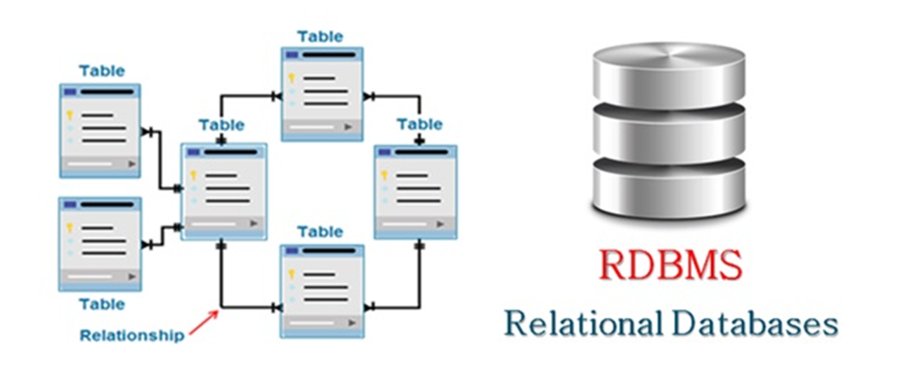

# Data Management for Business Analytics

	   This course focuses on database management 
	   systems and procedures with an emphasis on 
	   the design and  development  of  efficient  
	   business   information systems.   MySQL is  
	   used  to  teach  the basics  of relational 
	   database systems, structures, and database 
	   queries by using SQL.
	   
	   Data engineers build and design relational 
	   databases (+other data management systems) 
	   to  assist  organizations  in  collecting, 
	   storing,  and analyzing  data.  Then, data 
	   analysts and  data scientists use them  to 
	   digest large amounts  of data and identify 
	   meaningful insights.

------

## Relational Databases

		A relational database  organizes data into 
		tables with rows and columns, using unique 
		identifiers   called  keys   to  establish 
		relationships between them. This structure 
		allows for efficient storage and retrieval 
		of  related  data  and  is  based  on  the 
		relational model. Common  examples include 
		MySQL, PostgreSQL, and SQL Server. 

-----

## Relational Database Tables

		A relational database table is a fundamental 
		structure that  organizes data into rows and 
		columns, similar to a  spreadsheet, but with 
		specific constraints and relationships. Each 
		column represents a specific attribute (like 
		"name" or "price"), and each  row represents 
		a single  record  or item,  with  each  cell 
		containing a  single piece of data  for that 
		record. The relational part means that  data 
		is not isolated; these tables  can be linked 
		to one another through common columns called 
		keys, allowing  you  to  combine  and  query 
		information from different tables. 

-----

## Data storytelling

		Data storytelling is the practice  of combining 
		data, visuals,  and a  narrative to communicate 
		insights  in  a  clear  and compelling way.  It 
		goes beyond simply presenting numbers or charts 
		to help an audience understand the "why" behind 
		the  data,  enabling   them  to  grasp  complex 
		information, make decisions, and even take action.  
		

### Key elements:

##### Data: 
		The foundation  of the story, providing 
		the  factual  basis for the  narrative. 
		This includes various data points, from 
		raw numbers to complex datasets. 

##### Visuals: 
		Charts,  graphs, infographics,  and  other 
		visual  elements  are  used  to  represent 
		the data in an engaging and understandable 
		format. 

##### Narrative: 
		A compelling storyline that provides context, 
		connects  the  data  points,  and  guides the 
		audience  through the  information, typically 
		including an introduction, a main  point, and 
		a conclusion or call to action. 

------

## Data Visualization

		Data visualization is the graphical representation 
		of data using visual elements like charts, graphs, 
		and maps to help people see and understand trends, 
		patterns, and outliers.  The primary purpose is to 
		communicate   complex   information   clearly  and 
		efficiently,  making  data   more  accessible  and 
		enabling informed decision-making.

