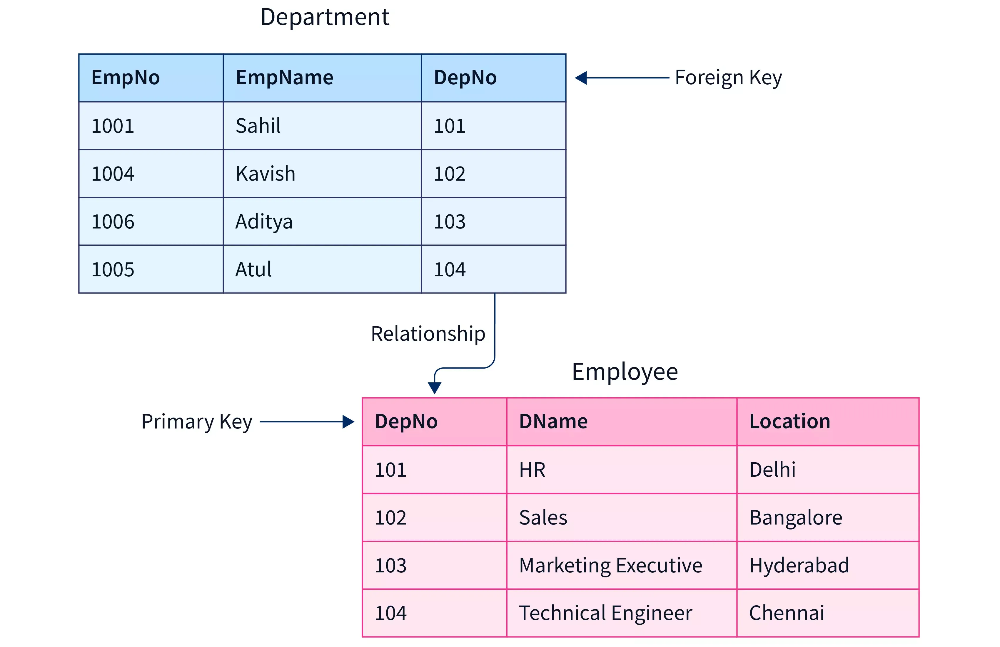

# CREATE TABLE with PK and FK

	1. In mysql, provide 2 tables creation
	   and specify PK and FK in schema
	   
	   

Let’s create two MySQL tables with a primary key (PK) and a foreign key (FK) relationship.

We’ll use an example of departments and employees tables.

⸻

## 1. Departments Table (Parent)

~~~mysql
CREATE TABLE departments (
    dept_id INT AUTO_INCREMENT,
    dept_name VARCHAR(50) NOT NULL,
    PRIMARY KEY (dept_id)
);
~~~

where

    •    dept_id is the Primary Key (PK).
    •    Each department has a unique ID.

⸻

## 2. Employees Table (Child)

~~~mysql
CREATE TABLE employees (
    emp_id INT AUTO_INCREMENT,
    emp_name VARCHAR(50) NOT NULL,
    dept_id INT,
    PRIMARY KEY (emp_id),
    FOREIGN KEY (dept_id) REFERENCES departments(dept_id)
        ON DELETE SET NULL
        ON UPDATE CASCADE
);
~~~

where

    •    1. emp_id is the Primary Key (PK).
    
    •    2. dept_id is a Foreign Key (FK) referencing departments(dept_id).
    
    •    3. ON DELETE SET NULL → if a department is deleted, 
            the employee’s dept_id becomes NULL.
         
    •    4. ON UPDATE CASCADE → if dept_id in departments changes, 
            it automatically updates in employees.

⸻

## 3. Sample Data

~~~mysql
-- Departments
INSERT INTO departments (dept_name) VALUES
('HR'),
('IT'),
('Finance');
~~~

~~~mysql
-- Employees
INSERT INTO employees (emp_name, dept_id) VALUES
('Alice', 1),
('Bob', 2),
('Charlie', 2),
('David', 3);
~~~

⸻

## 4. Tables Overview

departments

~~~mysql
dept_id    dept_name
1          HR
2          IT
3          Finance
~~~

employees

~~~mysql
emp_id    emp_name    dept_id
1         Alice       1
2         Bob         2
3         Charlie     2
4         David       3
~~~

⸻

## Notes...

	This structure ensures referential integrity: 
	every employee’s dept_id must exist in departments.

