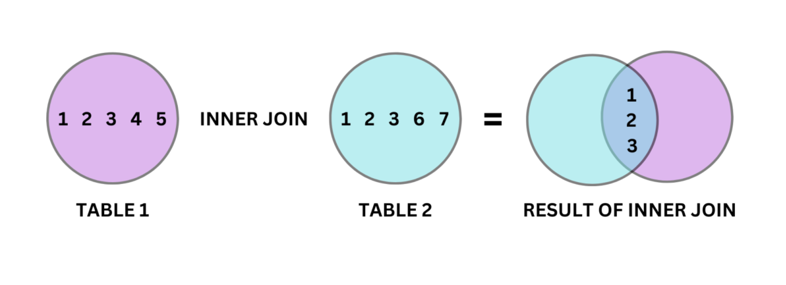
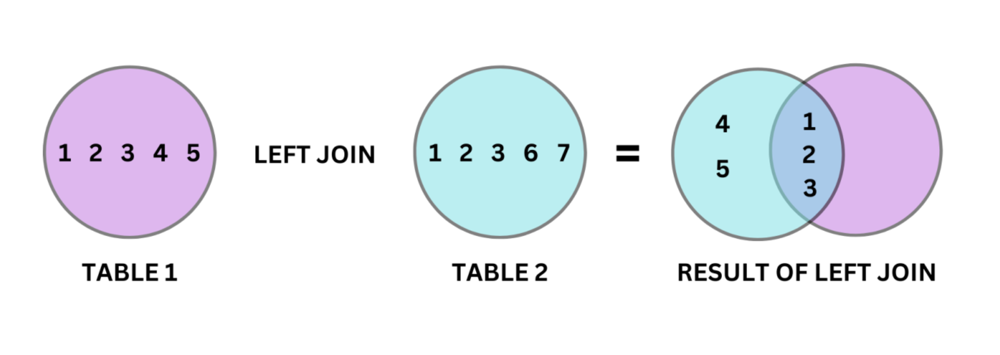
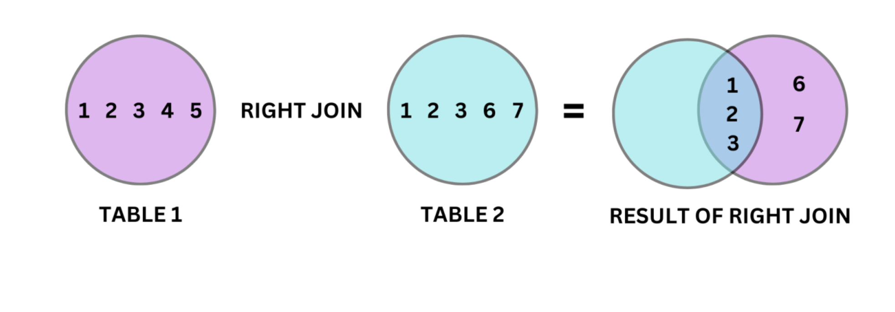
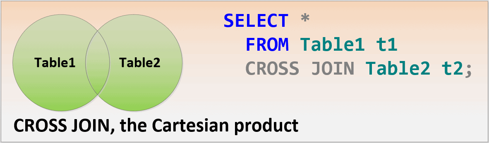
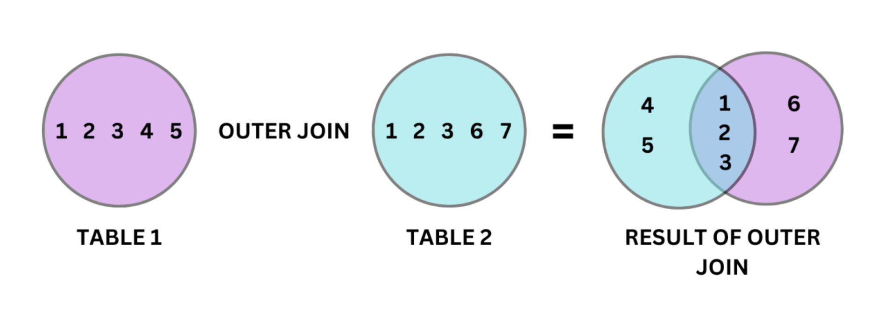

# Join Operations

## Inner Join

-----

## Left Join

-----

## Right Join

-----

## Full Join

-----

# SQL Joins Tutorials

[1. SQL Joins with Examples](https://stevestedman.com/consulting/training-classes/inner-join-vs-outer-join/sql-joins-with-examples-pdf)

[2. SQL JOIN for Beginners with Diagrams & Example Code](https://www.beekeeperstudio.io/blog/sql-joins-for-beginners-with-diagrams)

[3. SQL Cheat Sheet: The Ultimate Guide to All Types of SQL JOINS](https://www.dbvis.com/thetable/sql-cheat-sheet-every-join-explained)

