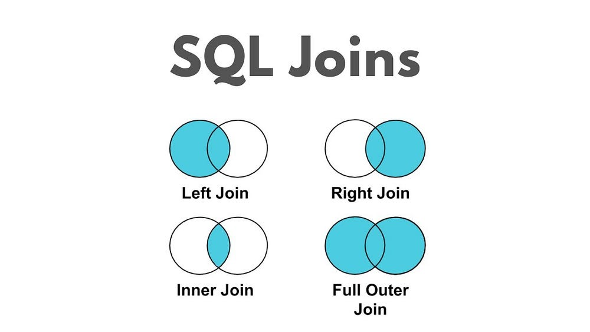
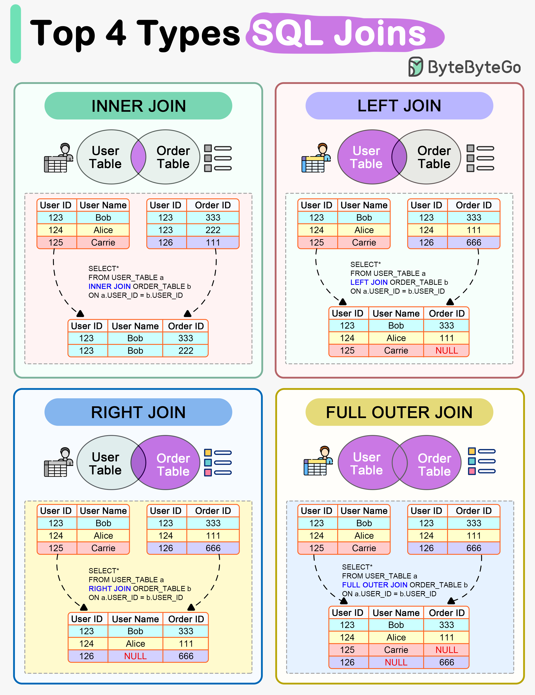

# Join Operations


	Using mysql database, Build 2 tables: employees (10 rows), 
	and departments (6 rows). The provide detailed examples of 
	all join operations (inner join, left join, right join), 
	with complete sql queries and results. For departments table 
	of 6 rows, make sure that 1 of the department is not assigned 
	to any employees.

	👌 Let’s build this step by step using MySQL.
	We’ll create two tables: employees and departments, 
	populate them, and then demonstrate 
	
	       INNER JOIN, 
	       LEFT JOIN, 
	       RIGHT JOIN
	        
	with realistic results.

⸻

## SQL Joins 



⸻


## Joins in Action




## 📘 Step 1 — Create departments Table

~~~mysql
CREATE TABLE departments (
    dept_id INT PRIMARY KEY,
    dept_name VARCHAR(50)
);

INSERT INTO departments (dept_id, dept_name) 
VALUES
(1, 'Engineering'),
(2, 'HR'),
(3, 'Finance'),
(4, 'Marketing'),
(5, 'Sales'),
(6, 'Legal');   -- No employees assigned
~~~

    •    Note: Legal (6) will have no employees.

⸻

## 📘 Step 2 — Create employees Table

~~~mysql
CREATE TABLE employees (
    emp_id INT PRIMARY KEY,
    name VARCHAR(50),
    dept_id INT,
    salary INT,
    FOREIGN KEY (dept_id) REFERENCES departments(dept_id)
);

INSERT INTO employees (emp_id, name, dept_id, salary) 
VALUES
(1, 'John Doe', 1, 75000),
(2, 'Jane Smith', 2, 60000),
(3, 'Robert Brown', 3, 82000),
(4, 'Linda Johnson', 1, 95000),
(5, 'Michael Williams', 4, 67000),
(6, 'Susan Jones', 3, 73000),
(7, 'David Miller', 1, 88000),
(8, 'Karen Davis', 5, 64000),
(9, 'James Wilson', 4, 70000),
(10, 'Patricia Moore', 2, 62000);
~~~

    •    Departments 1–5 have employees.
    •    Department 6 (Legal) has no employees.

⸻

## 📘 Step 3 — Demonstrating Joins

⸻

### 🔹 1. INNER JOIN (Only matching rows)

~~~sql
SELECT 
       e.emp_id, 
       e.name, 
       d.dept_name, 
       e.salary
FROM 
       employees e
INNER JOIN 
       departments d ON e.dept_id = d.dept_id;
~~~

Result (only employees with valid department):

~~~sql
emp_id    name              dept_name      salary
1         John Doe          Engineering    75000
2         Jane Smith        HR             60000
3         Robert Brown      Finance        82000
4         Linda Johnson     Engineering    95000
5         Michael Williams  Marketing      67000
6         Susan Jones       Finance        73000
7         David Miller      Engineering    88000
8         Karen Davis       Sales          64000
9         James Wilson      Marketing      70000
10        Patricia Moore    HR             62000
~~~
👉 Department Legal is excluded since no employees are assigned.

⸻

### 🔹 2. LEFT JOIN (All employees, with department info if exists)

~~~sql
SELECT 
     e.emp_id, 
     e.name, 
     d.dept_name, 
     e.salary
FROM 
     employees e
LEFT JOIN 
     departments d ON e.dept_id = d.dept_id;
~~~

Result (all employees, dept info when available):

~~~sql
emp_id    name              dept_name      salary
1         John Doe          Engineering    75000
2         Jane Smith        HR             60000
3         Robert Brown      Finance        82000
4         Linda Johnson     Engineering    95000
5         Michael Williams  Marketing      67000
6         Susan Jones       Finance        73000
7         David Miller      Engineering    88000
8         Karen Davis       Sales          64000
9         James Wilson      Marketing      70000
10        Patricia Moore    HR             62000
~~~

👉 Same as INNER JOIN, since all employees belong to a department.

⸻

### 🔹 3. RIGHT JOIN (All departments, with employee info if exists)

~~~sql
SELECT e.emp_id, e.name, d.dept_name, e.salary
FROM employees e
RIGHT JOIN departments d ON e.dept_id = d.dept_id;

Result (all departments, employees if available):

emp_id  name              dept_name    salary
1       John Doe          Engineering    75000
4       Linda Johnson     Engineering    95000
7       David Miller      Engineering    88000
2       Jane Smith        HR             60000
10      Patricia Moore    HR             62000
3       Robert Brown      Finance        82000
6       Susan Jones       Finance        73000
5       Michael Williams  Marketing      67000
9       James Wilson      Marketing      70000
8       Karen Davis       Sales          64000
NULL    NULL              Legal          NULL
~~~
👉👉👉 Notice that Legal (dept_id = 6) is included, 
with NULL for employee details.

⸻

✅ Summary:

    		•    INNER JOIN → Only matching rows.
    		
    		•    LEFT JOIN → All employees, even 
    		     if they don’t have a department.
    		     
    		•    RIGHT JOIN → All departments, 
    		     even if no employees assigned.

⸻


# Demonstrate a FULL OUTER JOIN in MySQL.

	👉👉👉 
	Since MySQL does not have a direct 
	FULL OUTER JOIN, we can simulate it 
	using a UNION of LEFT JOIN and RIGHT JOIN.

⸻

# 📘 FULL OUTER JOIN in MySQL (via UNION)

~~~sql
SELECT e.emp_id, e.name, d.dept_name, e.salary
FROM employees e
LEFT JOIN departments d ON e.dept_id = d.dept_id

UNION

SELECT e.emp_id, e.name, d.dept_name, e.salary
FROM employees e
RIGHT JOIN departments d ON e.dept_id = d.dept_id;
~~~

⸻

✅ Result

~~~sql
emp_id  name              dept_name    salary
1       John Doe          Engineering    75000
4       Linda Johnson     Engineering    95000
7       David Miller      Engineering    88000
2       Jane Smith        HR             60000
10      Patricia Moore    HR             62000
3       Robert Brown      Finance        82000
6       Susan Jones       Finance        73000
5       Michael Williams  Marketing      67000
9       James Wilson      Marketing      70000
8       Karen Davis       Sales          64000
NULL    NULL              Legal          NULL
~~~

⸻

📝 Explanation
    
    	•    The LEFT JOIN part ensures that all employees 
    	     are included (with departments if any).
    	     
    	•    The RIGHT JOIN part ensures that all departments 
    	     are included (even those without employees).
    	     
    	•    The UNION merges the results, producing 
    	     a FULL OUTER JOIN equivalent.

👉 In our dataset:

    •    All 10 employees appear.
    •    All 6 departments appear.
    •    Department Legal (6) has no employees → 
         appears with NULL employee fields.

⸻

# MORE Examples on Join Operation


	We’ll walk through a general explanation of SQL joins 
	using **MySQL syntax** and **simple data**.

---

### ✅ **Step 1: Define the Tables**

#### **`customers` Table** (3 rows)

| customer\_id | name  |
| ------------ | ----- |
| 1            | Alice |
| 2            | Bob   |
| 3            | Carol |

#### **`products` Table** (4 rows)

| product\_id | customer\_id | product\_name |
| ----------- | ------------ | ------------- |
| 101         | 1            | Laptop        |
| 102         | 2            | Phone         |
| 103         | 1            | Monitor       |
| 104         | 4            | Keyboard      |

Note:

* `products.customer_id` refers to the `customers.customer_id`
* Customer `1` (Alice) bought 2 products
* Customer `4` doesn't exist in the `customers` table

---

## 🔄 General SQL Join in MySQL

### ✅ **1. INNER JOIN**

Returns rows where there is a match in **both** tables.

```sql
SELECT 
    customers.customer_id,
    customers.name,
    products.product_name
FROM 
    customers
INNER JOIN 
    products ON customers.customer_id = products.customer_id;
```

#### ✅ Result:

| customer\_id | name  | product\_name |
| ------------ | ----- | ------------- |
| 1            | Alice | Laptop        |
| 1            | Alice | Monitor       |
| 2            | Bob   | Phone         |

Explanation:

* Only customers **with matching products** are shown.
* Carol (ID 3) is excluded.
* Keyboard (customer\_id = 4) is excluded because that customer doesn’t exist.

---

### ✅ **2. LEFT JOIN**

Returns **all customers**, even if they haven't bought anything.

```sql
SELECT 
    customers.customer_id,
    customers.name,
    products.product_name
FROM 
    customers
LEFT JOIN 
    products ON customers.customer_id = products.customer_id;
```

#### ✅ Result:

| customer\_id | name  | product\_name |
| ------------ | ----- | ------------- |
| 1            | Alice | Laptop        |
| 1            | Alice | Monitor       |
| 2            | Bob   | Phone         |
| 3            | Carol | NULL          |

Explanation:

* All customers are shown.
* Carol is included with `NULL` for product.
* Keyboard is still excluded (no matching customer).

---

### ✅ **3. RIGHT JOIN**

Returns **all products**, even if they don't belong to a customer.

```sql
SELECT 
    customers.customer_id,
    customers.name,
    products.product_name
FROM 
    customers
RIGHT JOIN 
    products ON customers.customer_id = products.customer_id;
```

#### ✅ Result:

| customer\_id | name  | product\_name |
| ------------ | ----- | ------------- |
| 1            | Alice | Laptop        |
| 1            | Alice | Monitor       |
| 2            | Bob   | Phone         |
| NULL         | NULL  | Keyboard      |

Explanation:

* All products are shown.
* Product "Keyboard" is included, even though customer\_id 4 doesn’t exist.

---

### ✅ **4. FULL OUTER JOIN** (Not supported natively in MySQL, but can be emulated)

```sql
SELECT 
    customers.customer_id,
    customers.name,
    products.product_name
FROM 
    customers
LEFT JOIN 
    products ON customers.customer_id = products.customer_id

UNION

SELECT 
    customers.customer_id,
    customers.name,
    products.product_name
FROM 
    customers
RIGHT JOIN 
    products ON customers.customer_id = products.customer_id;
```

#### ✅ Result:

| customer\_id | name  | product\_name |
| ------------ | ----- | ------------- |
| 1            | Alice | Laptop        |
| 1            | Alice | Monitor       |
| 2            | Bob   | Phone         |
| 3            | Carol | NULL          |
| NULL         | NULL  | Keyboard      |

Explanation:

* Combines both LEFT and RIGHT joins.
* Shows **all customers and all products**, matched or not.

---

### ✅ **5. CROSS JOIN**

Returns every possible combination (Cartesian product).

```sql
SELECT 
    customers.name,
    products.product_name
FROM 
    customers
CROSS JOIN 
    products;
```

#### ✅ Result: (3 customers × 4 products = 12 rows)

| name  | product\_name |
| ----- | ------------- |
| Alice | Laptop        |
| Alice | Phone         |
| Alice | Monitor       |
| Alice | Keyboard      |
| Bob   | Laptop        |
| Bob   | Phone         |
| Bob   | Monitor       |
| Bob   | Keyboard      |
| Carol | Laptop        |
| Carol | Phone         |
| Carol | Monitor       |
| Carol | Keyboard      |

Explanation:

* No filtering or matching — just all combinations.
* Rarely useful for real-world scenarios unless for testing or specific logic.

---

## 📌 Summary Table

| Join Type  | Includes...                      | Missing Rows                   |
| ---------- | -------------------------------- | ------------------------------ |
| INNER JOIN | Only matching customers/products | Unmatched customers & products |
| LEFT JOIN  | All customers, matched products  | Unmatched products             |
| RIGHT JOIN | All products, matched customers  | Unmatched customers            |
| FULL JOIN  | All customers and products       | None                           |
| CROSS JOIN | All combinations                 | N/A                            |

---

