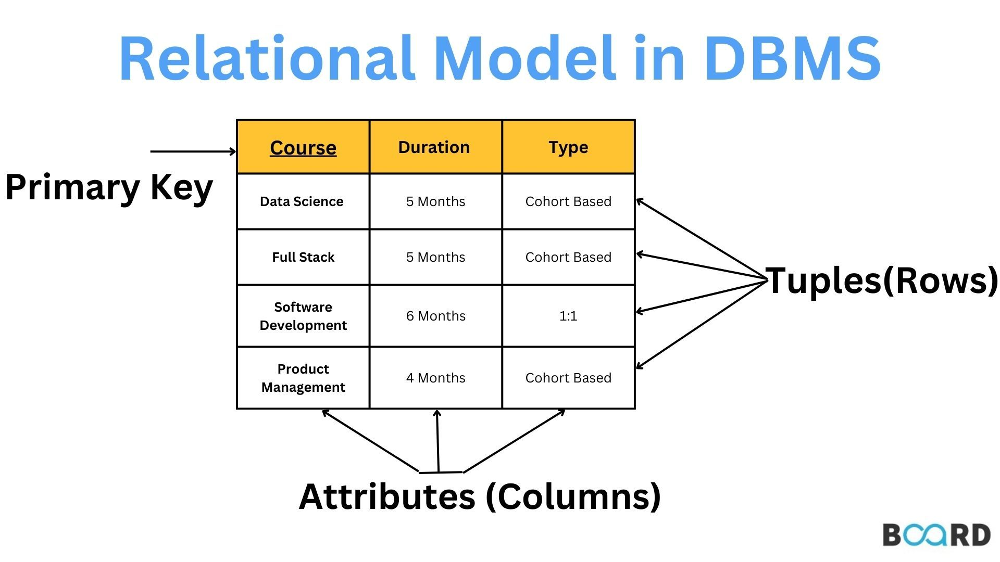
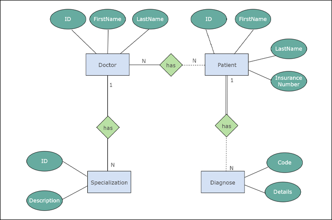

# 🧠 Introduction to <br> Relational Data Modeling

### Week 3 —  (16 Slides)

## 🧾 Slide 1: Introduction

### Relational Model:

		The Relational Model represents 
		{ data and their relationships 
		  through a collection of tables. }
		
		These tables are linked together by use 
		of PK (primary key) and FK (foreign key).
		
		Database = { set of related tables }
		Table = rows x columns

### Example: Linking Tables
	
		CREATE TABLE departments (
		    dept_id INT  PRIMARY KEY,
		    dept_name    VARCHAR(50)
		);

		CREATE TABLE employees (
		    emp_id INT PRIMARY KEY,
		    name    VARCHAR(50),
		    dept_id INT,
		    FOREIGN KEY (dept_id) REFERENCES departments(dept_id)
		);
		


### A relational Data Model 

		is the blueprint or structure of a database, 
		defining data in tables with rows and columns 
		linked by PK and FK keys. 

### Relational Data Modeling 

		is the process of creating that model, 
		a methodology for designing the database 
		structure, often using techniques like 
		normalization and entity-relationship diagrams. 
---

## 🧾 Slide 2: Learning Goals

By the end of this lesson, students will be able to:

- Explain what **data modeling** is and why it’s essential  
- Identify **entities**, **attributes**, and **relationships**  
- Define **primary** and **foreign keys**  
- Understand how to move from a **business story** to **SQL tables**  
- Explain the purpose of **normalization**  
- Create and query a **small relational database** in MySQL

---

## 🌍 Slide 3: Why Databases Need Models

* Think of a **database model** as a **blueprint** for your data 
* much like an architect’s plan for a building.

**Without a model:**

- Data becomes redundant or inconsistent  
- Queries become slow or confusing  
- Maintenance becomes difficult

**A good model makes data:**

- Organized  
- Connected logically  
- Reliable for decision-making

🧩 **Example:** 

		A bookstore without a model may store 
		customer and order data all in one table — 
		causing duplication and confusion.

---

## 🧮 Slide 4: What Is a Relational Model?

	* Relational data modeling is a method of 
	
	      organizing data into tables (relations) 
	      with rows and columns to show relationships 
	      between different pieces of information. 
	
	* It uses a system of primary and foreign keys to 
	
			link related data across tables, ensuring 
			data integrity and enabling efficient 
			retrieval and management. 
	
	* This model is the foundation for 
	
			most relational databases, which are used 
			in a wide range of applications, from small 
			desktop systems to large cloud-based platforms. 
			

The **relational model** organizes data into **tables (relations)** where each table represents a real-world entity.

| Concept | Description | Example |
|----------|--------------|----------|
| **Table (Relation)** | A collection of related data | `customers` |
| **Row (Tuple)** | One instance of data | One customer record |
| **Column (Attribute)** | Property of the entity | `name`, `email` |
| **Primary Key (PK)** | Unique identifier for a row | `customer_id` |
| **Foreign Key (FK)** | Reference to another table’s PK | `order.customer_id` → `customers.customer_id` |



---

## 🧩 Slide 5: Entities, Attributes, and Keys

- **Entity:** A real-world object or concept we store data about:

	* `Customer`, 
	* `Book`, 
	* `Order`, 
	* `Employee`
	  
- **Attributes:** Describe properties of an entity (e.g., 	`name`, `price`, `order_date`, `email`).  
- **Primary Key (PK):** Ensures uniqueness of each record.  
- **Foreign Key (FK):** Creates a link between related tables.

🧠 Example:  

- `customers(customer_id, name, email, country)`  

- `orders(order_id, customer_id, order_date)`  

Here, `customer_id` in `orders` is a **foreign key** referencing `customers`.

-------
## 🧩 Slide 6: Entities, Attributes: Examples


### Entity-Relationship-Diagram Template


-------

### Entity-Relationship-Diagram Example


---
### Entity-Relationship-Diagram Example




## 📖 Slide 7: Story — The ReadersHub Bookstore

ReadersHub is a small online bookstore.  

The business needs to track:

- Which customers make purchases  
- Which books are available for sale  
- What books are included in each order  
- When orders are placed

**Goal:** Design a relational model that captures this story accurately.

---

## 🧱 Slide 8: Identifying Entities from Requirements

From the ReadersHub story, we identify four main entities:

| Entity | Example Attributes |
|---------|--------------------|
| **`Customer`** | `customer_id`, `name`, `email`, `country` |
| **`Book`** | `book_id`, `ISBN`, `title`, `author`, `price`, `published_date` |
| **`Order`** | `order_id`, `customer_id`, `order_date` |
| **`Order_Item`** | `order_id`, `book_id`, `quantity`|

✅ **Each entity will become one table.**

---

## 🔗 Slide 9: Identifying Relationships

| Relationship | Type | Example |
|---------------|------|---------|
| **`Customer` → `Order`** | One-to-Many | A customer can have multiple orders |
| **`Order` → `Book`** | Many-to-Many | An order can include multiple books |
| **`Order_Item`** | Linking table | Connects orders and books |

💡 **Note:** Many-to-many relationships are resolved using a third table (here, `order_items`).

---

## 🧾 Slide 10: Visualizing the Model (Text-Based ER Diagram)

```
Customer (customer_id PK) ───< Order (order_id PK, customer_id FK)

Order ───< Order_Item (order_id FK, book_id FK)

Book (book_id PK)
```

Each arrow `<` represents a “many” side of the relationship.

🧠 Reading the diagram:  
- One customer has many orders.  
- One order can include many books.

---

## 🔑 Slide 11: Primary and Foreign Keys — The Glue

**Primary Key (PK):** Uniquely identifies a row.  

**Foreign Key (FK):** Creates relationships between tables.

Example:

```sql
CREATE TABLE orders (
  order_id INT AUTO_INCREMENT PRIMARY KEY,
  customer_id INT,
  FOREIGN KEY (customer_id) REFERENCES customers(customer_id)
);
```
### PK and FK example-1:

This ensures **referential integrity** — you can’t insert an order for a non-existent customer.

* Transaction Table: 
	* TransactionID is a PK
	* CustomerID is a FK
	* ProductID is a PK

	

---

### PK and FK example-2:
	


## 🧰 Slide 12: From Model to MySQL Tables

```sql
CREATE TABLE customers (
  customer_id INT AUTO_INCREMENT PRIMARY KEY,
  name VARCHAR(60),
  email VARCHAR(80),
  country VARCHAR(40)
);

CREATE TABLE books (
  book_id INT AUTO_INCREMENT PRIMARY KEY,
  title VARCHAR(100),
  author VARCHAR(60),
  price DECIMAL(8,2)
);

CREATE TABLE orders (
  order_id INT AUTO_INCREMENT PRIMARY KEY,
  customer_id INT,
  order_date DATE,
  FOREIGN KEY (customer_id) REFERENCES customers(customer_id)
);

CREATE TABLE order_items (
  order_id INT,
  book_id INT,
  quantity INT,
  PRIMARY KEY(order_id, book_id),
  FOREIGN KEY (order_id) REFERENCES orders(order_id),
  FOREIGN KEY (book_id) REFERENCES books(book_id)
);
```

---

## 🧠 Slide 13: Query Example — Join Multiple Tables

**Question:** Show each customer’s total order amount.

```sql
SELECT 
    c.name AS customer_name,
    SUM(b.price * oi.quantity) AS total_spent
FROM 
    customers c
JOIN 
    orders o ON c.customer_id = o.customer_id
JOIN 
    order_items oi ON o.order_id = oi.order_id
JOIN 
    books b ON oi.book_id = b.book_id
GROUP BY 
    c.name
ORDER BY 
    total_spent DESC;
```

💡 Shows the power of **relationships** in retrieving meaningful insights.

---

## 🧩 Slide 14: Understanding Normalization

**Normalization** removes redundancy and ensures data consistency.

| Normal Form | Ensures | Example |
|--------------|----------|----------|
| **1NF** | Atomic values (no lists) | One book per row |
| **2NF** | Every column depends on full PK | In `Order_Item`, quantity depends on (`order_id`, `book_id`) |
| **3NF** | No transitive dependency | Don’t store customer’s country in `orders` |

### [`Normalization 1NF example`](./normalization_1NF_example.md)

🎯 Goal: Balance between **efficiency** and **simplicity**.

---

## ⚙️ Slide 15: Common Mistakes & Best Practices

❌ **Common Mistakes**
- Repeating data across tables  
- Missing foreign key relationships  
- Using ambiguous column names  
- Mixing unrelated data in one table

✅ **Best Practices**
- Use meaningful names (e.g., `customer_id`, not `id`)  
- Always define PKs and FKs  
- Use consistent data types and constraints  
- Keep it normalized but practical

---

## 🎓 Slide 16: Summary & Practice Exercise

### Key Takeaways:
- Data modeling is the **foundation** of database design  
- Every model starts with **real-world understanding**  
- Proper use of **PKs, FKs, and normalization** ensures quality data  

### Exercise:
Create a small model for **Movie Rentals**:  
- Entities: `Customer`, `Movie`, `Rental`  
- Define relationships and keys  
- Write 3 `CREATE TABLE` statements  

---

### 🧾 Author
**Dr. Mahmoud Parsian**  
_Last updated: November 2, 2025_
