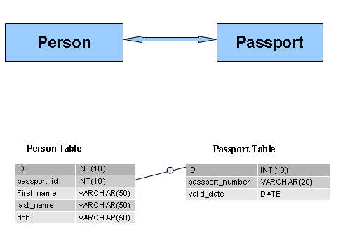
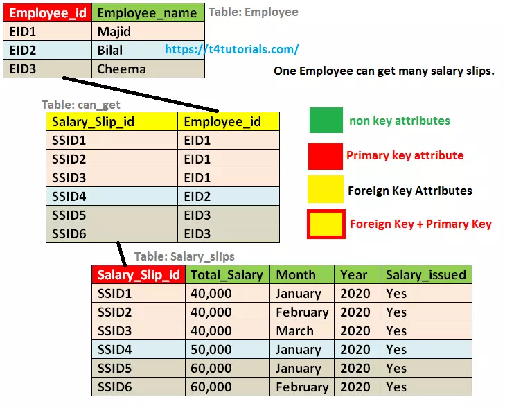
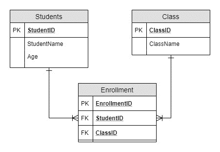

# Teaching Slides: One-to-One, One-to-Many, Many-to-Many Relationships

---

## Slide 1: Introduction
- Relational databases model real-world entities and their relationships.  
- Three key relationship types:  
  1. **One-to-One**  
  2. **One-to-Many**  
  3. **Many-to-Many**  
- Understanding these helps in **data modeling** and **query design**.

---

## Slide 2: One-to-One Concept
- **Definition**: One record in Table A relates to exactly one record in Table B.  
- Used when we want to **separate optional or sensitive information**.  

**Example-1**:  
- Table A: Students (basic info)  
- Table B: Student Profiles (DOB, SSN) 

**Example-2**:

 


---

## Slide 3: One-to-One Schema Example
```sql
CREATE TABLE students (
  student_id INT PRIMARY KEY,
  name VARCHAR(50),
  major VARCHAR(50)
);

CREATE TABLE student_profiles (
  student_id INT PRIMARY KEY,
  date_of_birth DATE,
  national_id VARCHAR(20) UNIQUE,
  FOREIGN KEY (student_id) REFERENCES students(student_id)
);
```

---

## Slide 4: One-to-One Illustration
- **Student → Student Profile**  
  - Alice → DOB, SSN111  
  - Bob → DOB, SSN222  

**SQL Example:**  
```sql
SELECT s.name, p.date_of_birth
FROM students s
JOIN student_profiles p ON s.student_id = p.student_id;
```

---

## Slide 5: One-to-Many Concept
- **Definition**: One record in Table A relates to many records in Table B.  
- Common when one entity can manage multiple dependent entities.  

**Example-1**:  

- One **Professor** teaches many **Courses**.

**Example-2**:  




---

## Slide 6: One-to-Many Schema Example
```sql
CREATE TABLE professors (
  professor_id INT PRIMARY KEY,
  name VARCHAR(50),
  department VARCHAR(50)
);

CREATE TABLE courses (
  course_id INT PRIMARY KEY,
  course_name VARCHAR(50),
  professor_id INT,
  FOREIGN KEY (professor_id) REFERENCES professors(professor_id)
);
```

---

## Slide 7: One-to-Many Illustration
- **Professor → Courses**  
  - Dr. Smith → Databases, Algorithms, Operating Systems  

**SQL Example:**  
```sql
SELECT p.name, c.course_name
FROM professors p
JOIN courses c ON p.professor_id = c.professor_id;
```

---

## Slide 8: Many-to-Many Concept
- **Definition**: Records in Table A relate to many records in Table B and vice versa.  
- Implemented using a **junction/bridge table**.  

**Example-1**:  

- Students ↔ Enrollments ↔ Courses  

**Example-2**:



---

## Slide 9: Many-to-Many Schema Example
```sql
CREATE TABLE enrollments (
  student_id INT,
  course_id INT,
  grade CHAR(2),
  PRIMARY KEY(student_id, course_id),
  FOREIGN KEY(student_id) REFERENCES students(student_id),
  FOREIGN KEY(course_id) REFERENCES courses(course_id)
);
```

---

## Slide 10: Many-to-Many Illustration
- **Student → Courses**  
  - Alice → Databases, Algorithms  
  - Bob → Calculus  
- **Course → Students**  
  - Databases → Alice, David, Grace  

**SQL Example:**  
```sql
SELECT s.name, c.course_name, e.grade
FROM students s
JOIN enrollments e ON s.student_id = e.student_id
JOIN courses c ON e.course_id = c.course_id;
```

---

## Slide 11: Summary of Relationships
- **One-to-One**: Students ↔ Student Profiles  
- **One-to-Many**: Professors → Courses  
- **Many-to-Many**: Students ↔ Courses (via Enrollments)  

---

## Slide 12: Key Teaching Points
- Relationships help **organize data** logically.  
- They affect:  
  - Table design (PK/FK usage)  
  - Query complexity (simple joins vs. bridge tables)  
- Practice with **JOINs** is essential to master them.  

---

## Slide 13: Closing Example
**Find all students with their major, professor name, and course enrolled:**  
```sql
SELECT s.name AS student, s.major, p.name AS professor, c.course_name, e.grade
FROM students s
JOIN enrollments e ON s.student_id = e.student_id
JOIN courses c ON e.course_id = c.course_id
JOIN professors p ON c.professor_id = p.professor_id;
```

---

## Slide 14: Recap
- **One-to-One**: Specialized info, private details.  
- **One-to-Many**: One entity with multiple dependents.  
- **Many-to-Many**: Junction table to manage cross-relationships.  
- Essential foundation for **database modeling** and **SQL mastery**.

---
